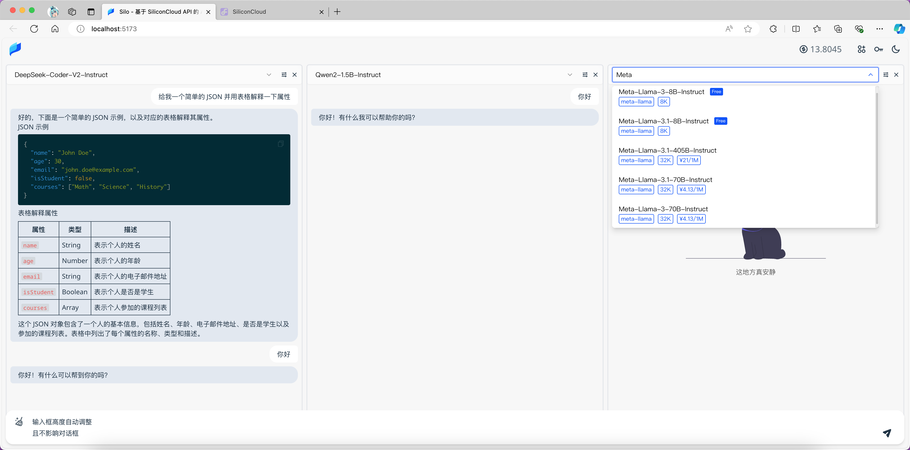
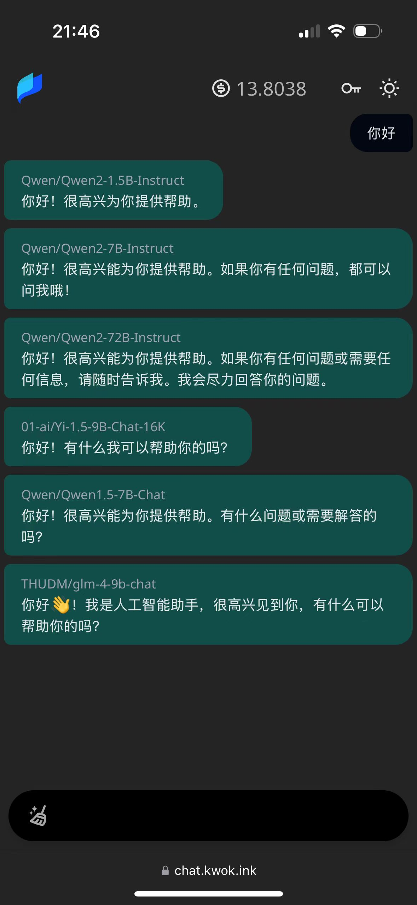

[English Version](https://github.com/KwokKwok/Silo/blob/main/README_EN.md)

<p align="center"><a href="https://silo-chat.vercel.app" target="_blank" rel="noreferrer noopener"></a></p>
<h1 align="center">Silo - 纯前端多模型对话、文生图</h1>

<p align="center"><a target="_blank" rel="noreferrer noopener" href="https://silo-chat.vercel.app"></a></p>
<p align="center"><a rel="noreferrer noopener" target="_blank" href="https://chromewebstore.google.com/detail/nakohnjaacfmjiodegibhnepfmioejln"></a> 
<!-- <a rel="noreferrer noopener" target="_blank" href="https://microsoftedge.microsoft.com/addons/detail/silo-siliconcloud-api-p/kjfjhcmdndibdlfofffhoehailbdlbod"></a>  -->
<a target="_blank" rel="noreferrer noopener" href="https://vercel.com/new/clone?repository-url=https%3A%2F%2Fgithub.com%2FKwokKwok%2FSilo.git&project-name=silo&repository-name=silo&env=SILO_EXPERIENCE_SK&envDescription=%E8%BE%93%E5%85%A5%200%20%E8%A1%A8%E7%A4%BA%E4%B8%8D%E6%8F%90%E4%BE%9B%E4%BD%93%E9%AA%8C%E5%AF%86%E9%92%A5%E6%96%B9%E5%BC%8F%E8%AE%BF%E9%97%AE%EF%BC%8C%E6%9B%B4%E5%A4%9A%E7%8E%AF%E5%A2%83%E5%8F%98%E9%87%8F%E5%8F%AF%E6%9F%A5%E7%9C%8B%20GitHub%20README%20%E8%AF%B4%E6%98%8E&envLink=https%3A%2F%2Fgithub.com%2FKwokKwok%2FSilo%3Ftab%3Dreadme-ov-file%23%E7%8E%AF%E5%A2%83%E5%8F%98%E9%87%8F%E5%8F%8A%E8%AF%B4%E6%98%8E"></a></p>

<br/>
<p align="center">Silo 是一个主要基于  <a target="_blank" href="https://siliconflow.cn/zh-cn/siliconcloud" target="_blank">SiliconCloud</a>  API 的应用，目前已支持多个大模型同时<b>对话、文生图</b>，响应极快。支持模型参数调整、余额自动刷新等功能。</p>
<p align="center">你也可以方便的添加 Google Gemini、Claude、X-AI/Grok、OpenAI 等模型。</p>
<p align="center">不需要服务端。</p>
<br/>

## 特点

🌐 提供浏览器插件和 Web 端的访问方式，插件支持划词解释和页面总结<br>
🚀 基于 SiliconCloud API，模型丰富，响应快<br>
🔑 配置简单，只需配置一次密钥<br>
💰 支持 SiliconCloud 余额自动刷新<br>
🧩 可以通过自定义模型的功能来接入更多对话模型。快速支持 Gemini、Claude、DeepSeek、智谱等，提供 OpenAI 兼容配置，以及自己写代码的硬核方式<br>
🔄 支持调整模型顺序<br>
🌙 夜间模式<br>
🧘‍♂️ 禅模式<br>
🇬🇧 多语言支持 <br>
📱 手机端支持（受限于屏幕尺寸，提供较简单的版本）<br>
📦 纯前端实现（方便迁移、CDN 部署等，不依赖服务器中转）<br>
🔧 模型参数调整<br>
💬 优化的输入体验<br>

<!-- 

 -->

## 通过 URL 设置参数

Silo 支持通过 URL 获取参数，这使得它可以作为搜索引擎使用。例如，在 Chrome 中将 `https://silo-chat.vercel.app/#/chat?q=%s` 添加为搜索引擎。

此外，你可以通过指定 `active_models` 或 `system_prompt_id` 来临时设置新对话页面的模型和系统提示词。

可用参数：

```js
- q: 对话问题，适用于搜索引擎
- active_models: 激活的对话模型 ID，多个模型用英文逗号分隔。模型 ID 可在对话面板中复制
- system_prompt_id: 激活的系统提示词 ID。系统提示词 ID 可在选择页面复制
```

> [!NOTE]
> 比如，你可以通过指定 `system_prompt_id` 提供一个翻译引擎<br>`https://silo-chat.vercel.app/#/chat?q=%s&system_prompt_id=preset-english-translator`

## 浏览器扩展

<p align="left"><a target="_blank" rel="noreferrer noopener" href="https://chromewebstore.google.com/detail/nakohnjaacfmjiodegibhnepfmioejln"></a>
<!-- <a rel="noreferrer noopener" target="_blank" href="https://microsoftedge.microsoft.com/addons/detail/silo-siliconcloud-api-p/kjfjhcmdndibdlfofffhoehailbdlbod"></a>  -->
<a target="_blank" rel="noreferrer noopener" href="https://github.com/KwokKwok/SiloChat/releases"></a></p>

当本项目发生版本变更时，会自动打包提交到 Chrome 应用商店。并将产生的 zip 文件上传到 [GitHub Releases](https://github.com/KwokKwok/SiloChat/releases)，您也可以直接下载并在浏览器中安装。

## Docker 部署

```yaml
version: '3.8'

services:
  frontend:
    image: ghcr.io/kwokkwok/silo:latest
    restart: always
    ports:
      - '3000:3000'
    environment:
      # 设置硅基流动体验 API 密钥
      - SILO_EXPERIENCE_SK=
      # 默认激活的对话模型
      - SILO_DEFAULT_ACTIVE_CHAT_MODELS=Qwen/Qwen2.5-7B-Instruct,THUDM/glm-4-9b-chat,01-ai/Yi-1.5-9B-Chat-16K
```

## 环境变量及说明

> [!NOTE]
> 本部分普通用户无需关心，仅自行部署者可能需要了解。环境变量配置后可能需要重启或重新部署。请自行验证是否生效。

> [!NOTE]
> 再次提醒，本项目是纯前端的，配置的密钥可能会被恶意使用，请谨慎配置。

```js
- SILO_EXPERIENCE_SK: 硅基流动体验 API 密钥。可输入 0 代表不提供该方式
- SILO_PAID_SK: 硅基流动付费 API 密钥，设置之后不会有体验密钥提示及限制
- PAID_SK_PASSWORD: 保护付费密钥的密码，设置之后用户界面输入密码即可自动使用付费密钥。设置 SILO_PAID_SK 时强烈建议同时设置该变量。请注意，该变量不以 SILO_ 开头
- SILO_AFF_LINK: 硅基流动密钥弹框处注册链接
- SILO_DEFAULT_ACTIVE_CHAT_MODELS: 默认激活的对话模型，多个模型以英文逗号分隔
- SILO_DEFAULT_ACTIVE_IMAGE_MODELS: 默认激活的文生图模型，多个模型以英文逗号分隔
```

## 致谢

1. 感谢 [SiliconCloud](https://siliconflow.cn/zh-cn/siliconcloud)。
1. 聊天页面参考 [Vercel AI Playground](https://sdk.vercel.ai/playground)、分栏参考 [ChatHub](https://chathub.gg/)
1. 翻译使用了 [沉浸式翻译](https://immersivetranslate.com/zh-Hans/) 的默认 Prompt，很有效，感谢！

## 许可证

本项目采用 MIT 许可证。详情请见[LICENSE](LICENSE)文件。

## 更多

<details>
<summary>Buy me a 辣条</summary>

### Buy me a 辣条

> 感谢 [黄少侠@即刻](https://m.okjike.com/users/18C4EC79-964F-4DF5-8D63-033A2345B2ED) 的提议。本项目开源且完全免费，如果您觉得本项目对您有用，欢迎 Buy me a 辣条~


</details>
